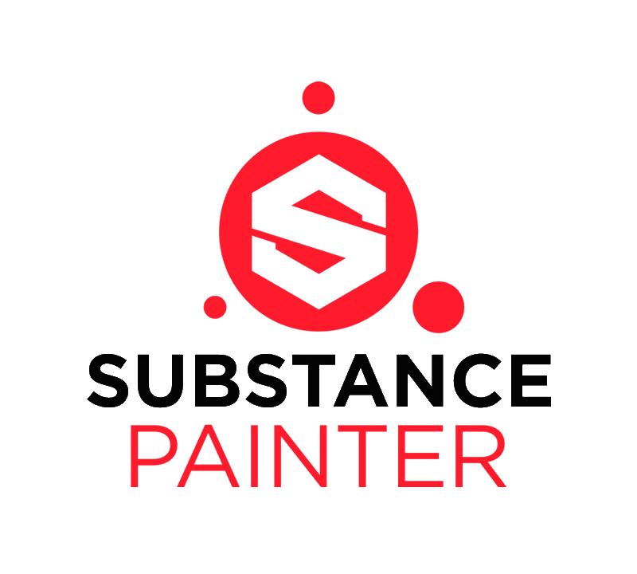
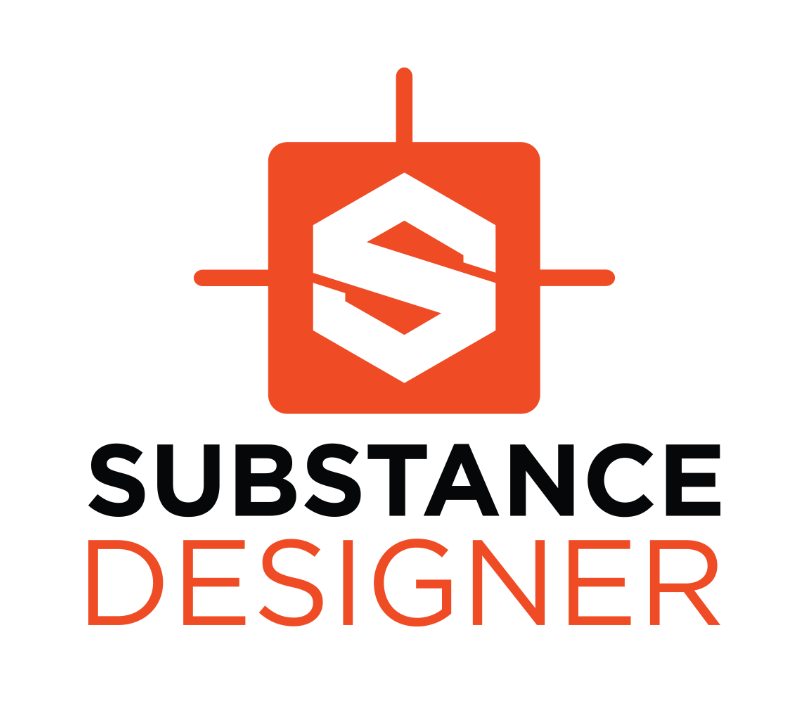
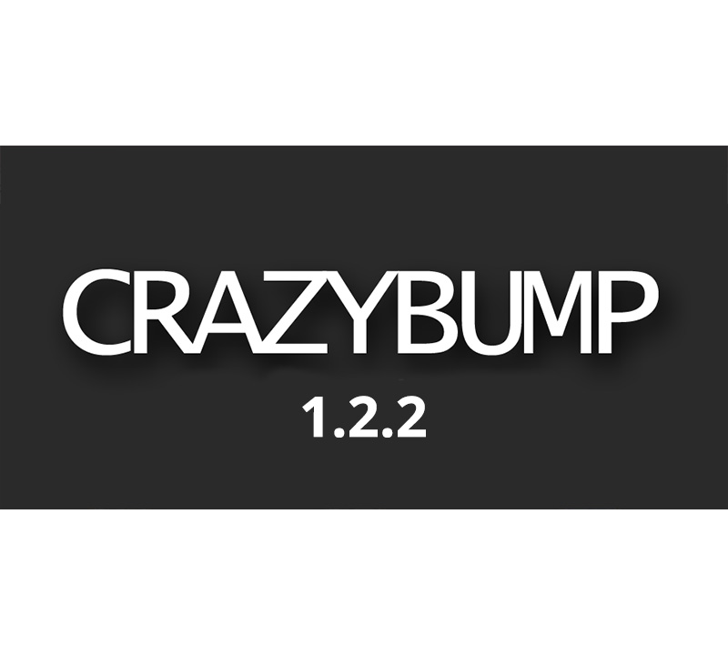
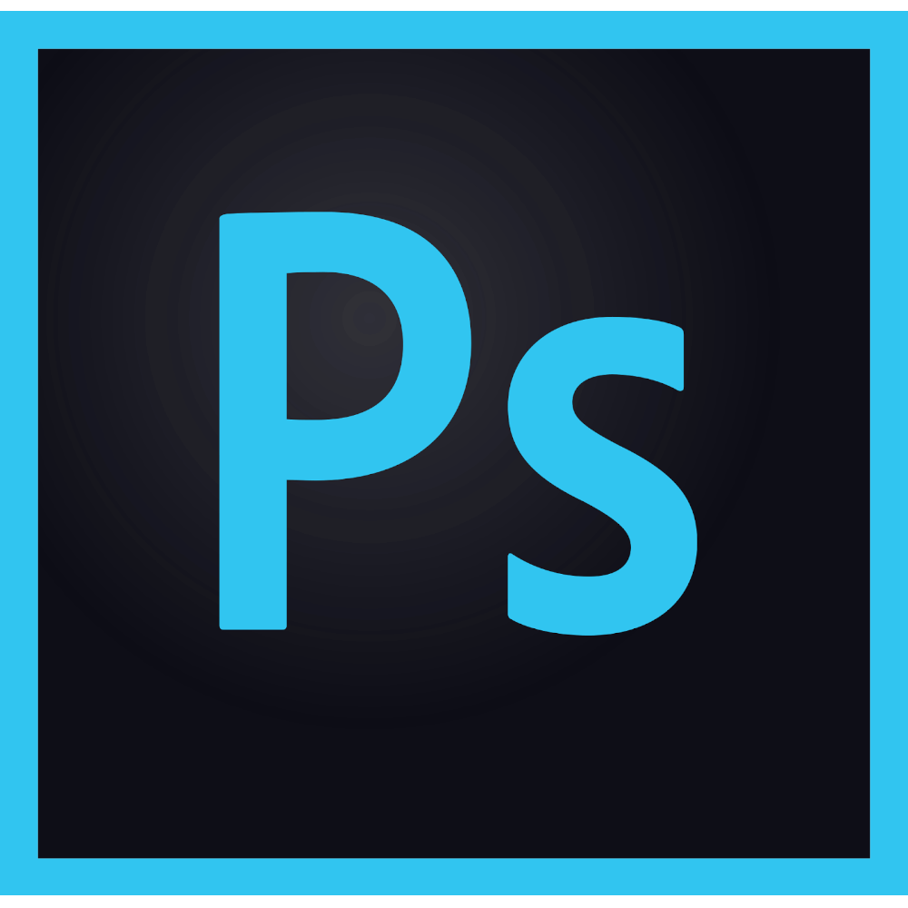
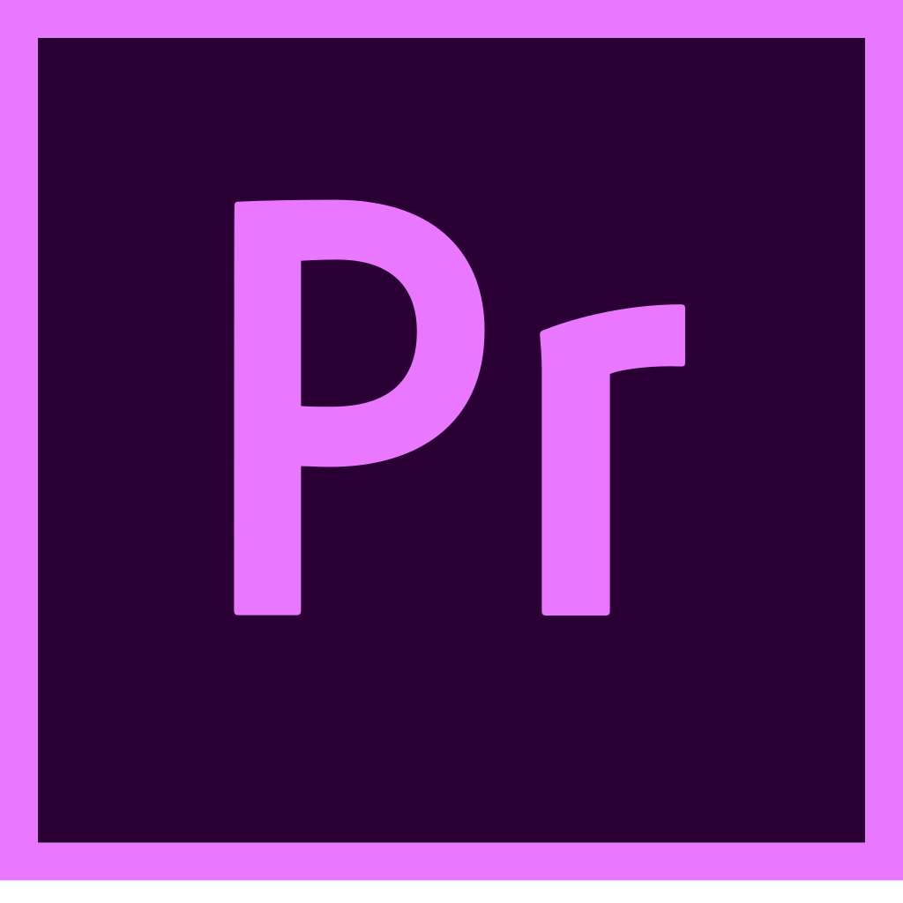
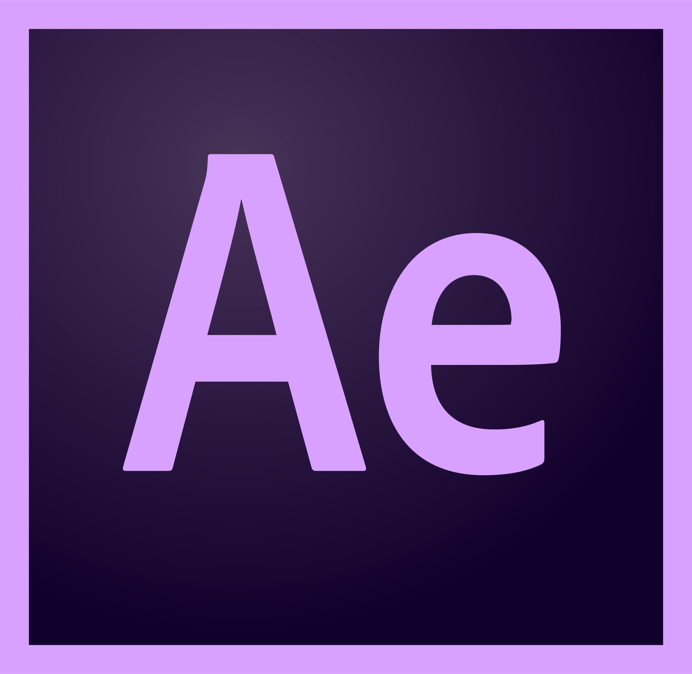
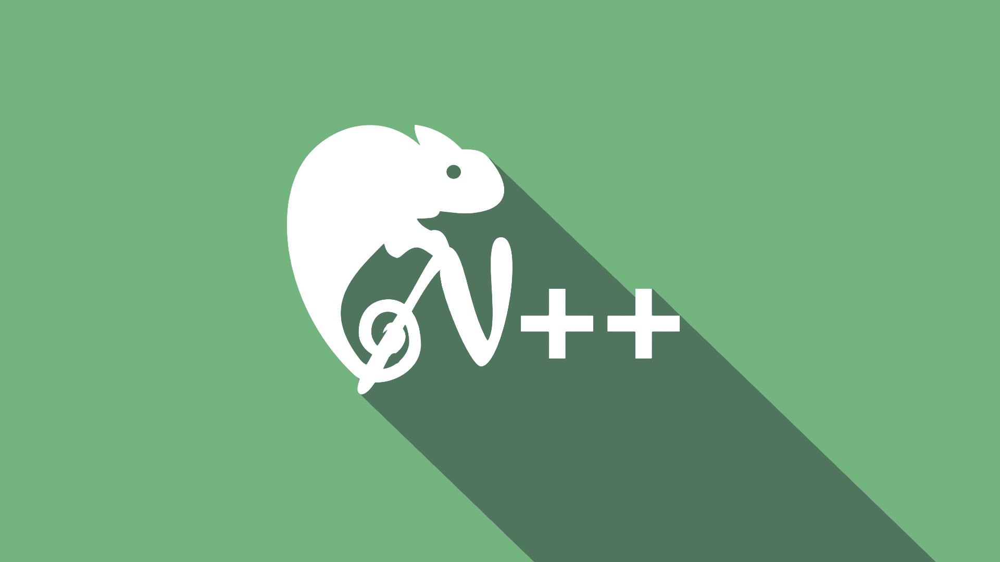

#### Here you can see the stack of programs in which I work. 
#### (logos contain links)

---

#### Hard-surface modeling programs:

<table>
<tr>

<td>
 
</td>

<td>

</td>

</tr>
</table>

#### Programs for texturing:

<table>
<tr>

<td>
 
</td>

<td>
 
</td>

<td>
 
</td>

</tr>
</table>

#### Render:

<table>
<tr>

<td>

</td>

</tr>
</table>

#### Raster editors:

<table>
<tr>

<td>

</td>

<td>
 
</td>

</tr>
</table>

#### Vector editor:

<table>
<tr>

<td>

</td>

</tr>
</table>

#### Video editor and post prodaction:

<table>
<tr>

<td>

</td>

<td>

</td>

</tr>
</table>

#### Text editors:

<table>
<tr>

<td>

</td>

<td>

</td>

</tr>
</table>

#### Game engines:

<table>
<tr>

<td>

</td>

<td>
 
</td>

</tr>
</table>